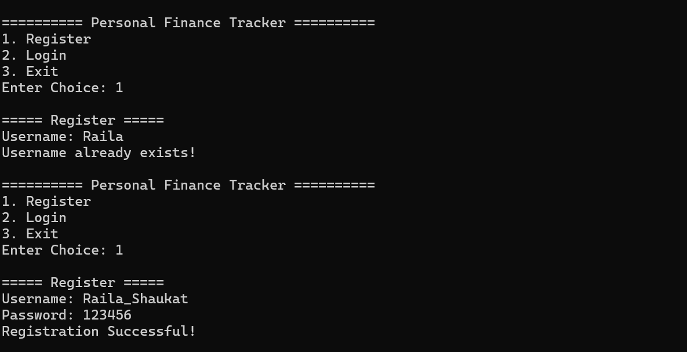
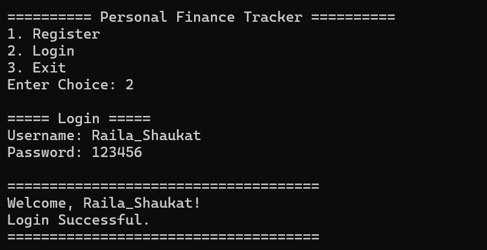
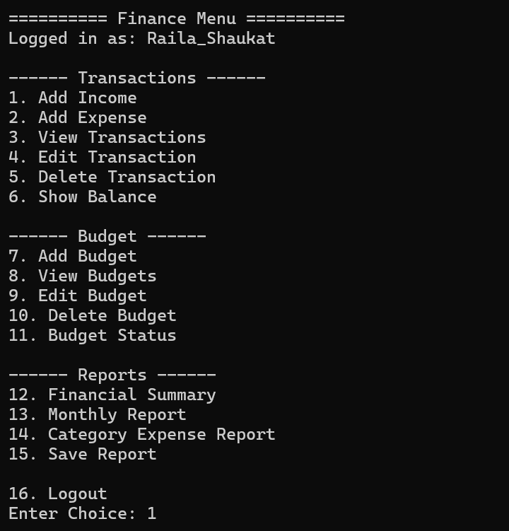
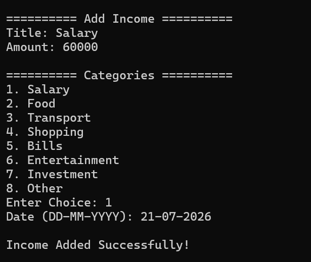
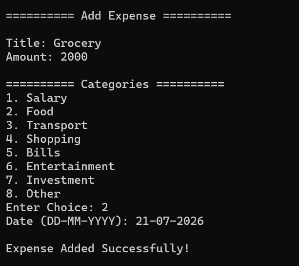
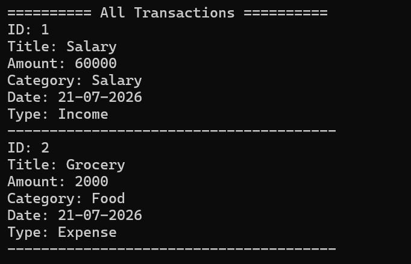
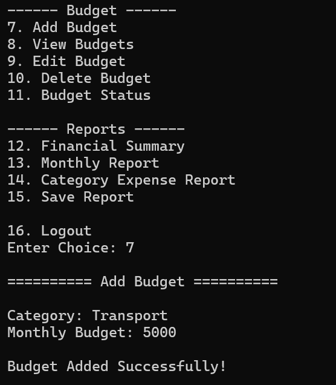
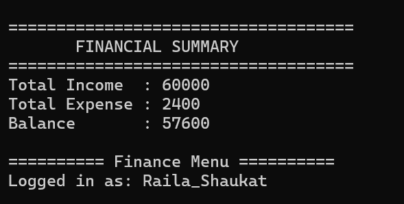
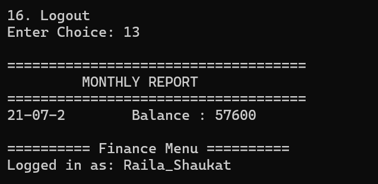
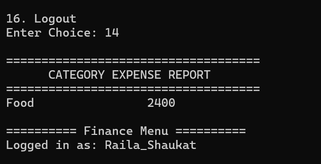

# 💰 Personal Finance Tracker

A console-based Personal Finance Tracker developed in **C++** using **Object-Oriented Programming (OOP)** principles. The application helps users manage their personal finances by recording income and expenses, creating budgets, generating reports, and storing data using file handling.

---

## Features

### User Management
- User Registration
- User Login
- Authentication System

### Transaction Management
- Add Income
- Add Expense
- View Transactions
- Edit Transaction
- Delete Transaction
- Balance Calculation

### Budget Management
- Create Budget
- View Budget
- Edit Budget
- Delete Budget
- Budget Status Monitoring

### Financial Reports
- Financial Summary
- Monthly Report
- Category Expense Report
- Save Report

### Data Storage
- File-based persistent storage
- Automatic loading and saving of data

### Input Validation
- Empty input validation
- Numeric input validation
- Positive amount validation

---

## Technologies Used

- C++
- Object-Oriented Programming (OOP)
- STL (Vector, Map, String)
- File Handling
- MSYS2 UCRT64
- Visual Studio Code
- Git & GitHub

---

## Project Structure

```
personal-finance-tracker/
│
├── include/
│
├── src/
│
├── data/
│
├── reports/
│
├── screenshots/
│
├── README.md
├── LICENSE
└── .gitignore
```

---

## How to Run

### Clone Repository

```bash
git clone https://github.com/raila_shaukat/personal-finance-tracker.git
```

### Compile

```bash
g++ -std=c++17 src/*.cpp -Iinclude -Iexternal/json/single_include -o FinanceTracker.exe
```

### Run
```bash
./FinanceTracker.exe
```

---

## Requirements

- C++17 compatible compiler (GCC/G++)
- Git
- Windows / Linux

## Screenshots

### Login


### Register


### Finance Menu


### Add Income


### Add Expense


### Transactions


### Budget


### Financial Summary


### Monthly Report


### Category Report


---

## Future Improvements

- Password Encryption
- CSV Export
- JSON Database
- Charts and Analytics
- GUI Version using Qt
- SQLite Integration

---

## Learning Outcomes

This project demonstrates practical implementation of:

- Object-Oriented Programming
- File Handling
- Modular Programming
- Input Validation
- Data Persistence
- STL Containers
- Git & GitHub Workflow

---

## Author

**Raila Shaukat**

BS Information Technology

GitHub:
https://github.com/raila-shaukat